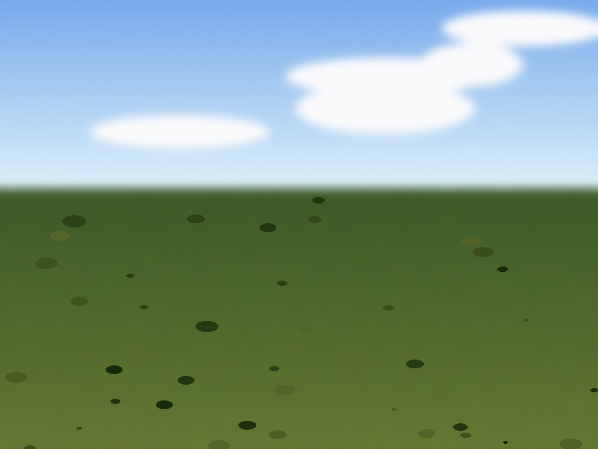
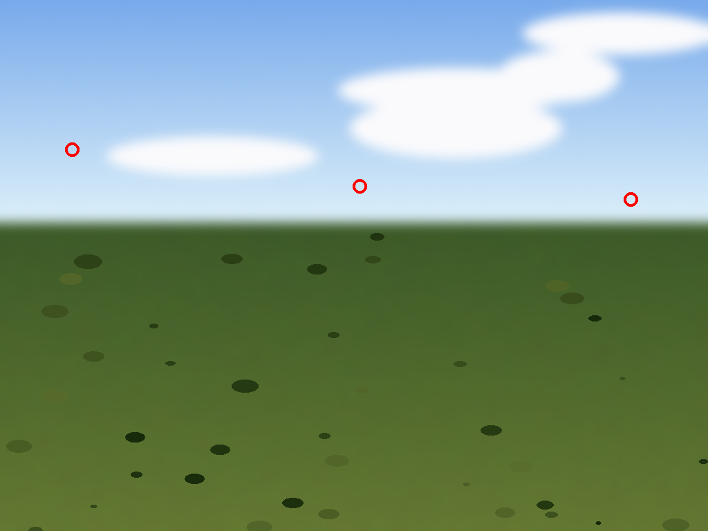
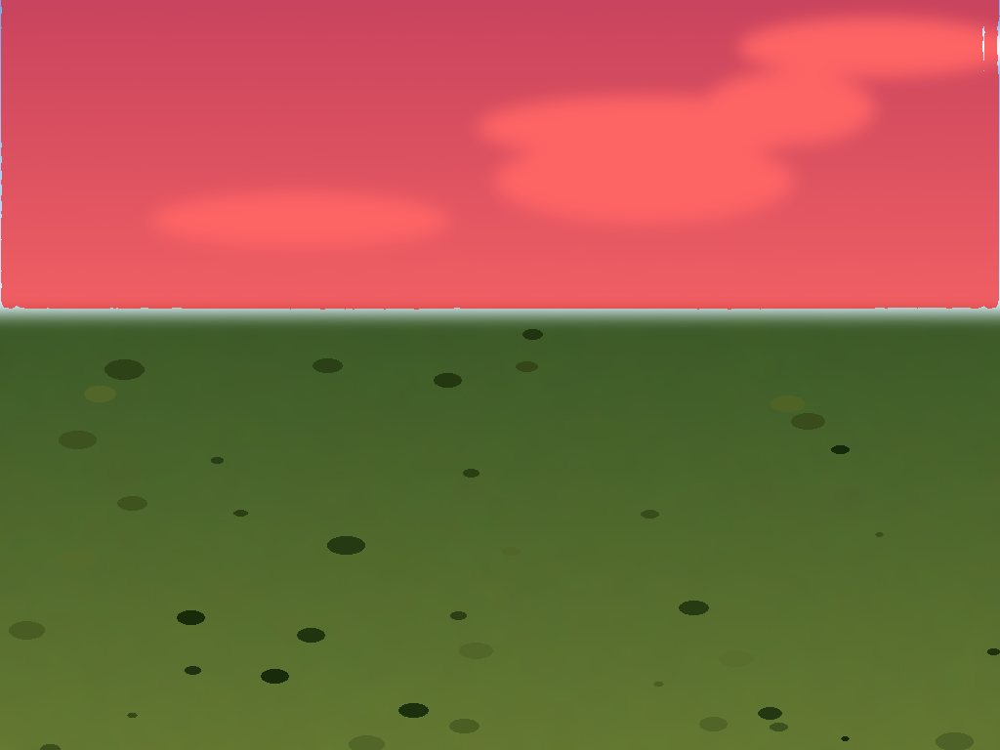

# Sky segmentation — spike results and recommended approach

Per PRD §6.7/§8b/§10: darktable has no dedicated "sky" segmentation class, and the PRD flagged this as
needing either a fine-tuned model or a heuristic on top of SAM 2. This doc records a real, validated spike
proving out the heuristic path — **no new ML model needed.**

## Confirmed still genuinely unsolved upstream

Unlike the RAW+JPEG-pairing and SAM2-segmentation assumptions (both turned out to already exist upstream),
sky segmentation really doesn't: `grep -rn "sky" src/` turns up only false positives (color names like
"sky blue", `choleski.h`'s "Cholesky" substring match, and `DT_SOLVE_OPTIMIZE_SKY` — a hue-optimization mode
in the channel mixer, unrelated to segmentation). A GitHub search across `darktable-org/darktable` and
`darktable-org/darktable-ai` for sky-segmentation issues/PRs found nothing beyond the general SAM2 object-mask
work (#20378) and an unrelated bayer-sensor highlight-recovery WIP (#10716, closed, different problem
entirely). No dedicated sky model exists in `data/ai_models.json` or the `darktable-ai` model repo.

## Recommended approach: heuristic seed points + the existing SAM2 decoder (zero new models)

Since darktable already ships a working SAM 2.1 point-prompt segmentation pipeline (see
[PHASE2_NOTES.md](PHASE2_NOTES.md)), the cheapest and most consistent path to "automatic" sky detection is:
compute a plausible sky point (or a few) *heuristically* from pixel statistics, then feed it to the
**exact same** `dt_seg_encode_image()` / `dt_seg_compute_mask()` API the interactive object-mask tool
already uses — just without requiring a manual click. This avoids sourcing, training, converting, and
maintaining a whole separate ONNX model for one class.

### Heuristic

For a downsampled grid of candidate pixels, score:

- **blueness** — `B - (R+G)/2`, positive for blue sky
- **whiteness** — inverse of saturation (`255 - (max - min)` per pixel), catches white/grey clouds and hazy sky
- **brightness** — mean of R/G/B (sky is usually bright relative to foreground)
- **smoothness** — inverse of local gradient magnitude on blurred luminance (sky lacks high-frequency texture; ground/foliage/rock don't)
- **vertical position prior** — linearly favors upper rows (sky is typically near the top of frame)

Weighted sum → threshold at the 85th percentile → connected-component labeling → take the **largest**
component (avoids picking an isolated noisy pixel) → seed point(s) are the component's centroid plus two
points spread along its horizontal extent (multiple foreground points make SAM's decoder more robust than
a single click).

Full prototype: [sky-segmentation-spike/sky_heuristic.py](sky-segmentation-spike/sky_heuristic.py).

### Spike validation (real weights, real inference, not simulated)

1. Generated a synthetic test photo — blue-gradient sky with soft clouds above a textured green/brown
   ground, clean horizon at 42% height (avoided using any real/copyrighted photo for this test; a
   procedurally generated image is enough to validate the *algorithm's mechanics*).
   
2. Ran the heuristic — all 3 candidate points landed cleanly in clear sky, between clouds, away from the
   horizon and ground texture:
   
3. Downloaded the real `mask-object-sam21-small.dtmodel` (same one verified in the Phase 2 spike),
   compiled a temporary throwaway harness linking directly against `src/common/ai/segmentation.c` (real,
   unmodified upstream code — not reimplemented), and called `dt_seg_encode_image()` +
   `dt_seg_compute_mask()` with the 3 heuristic points as `label=1` (foreground) prompts.
4. Result: **`IoU=0.984`** (SAM2's own predicted-IoU confidence head — its own estimate of mask quality),
   and visually the mask boundary sits exactly on the horizon with no bleed into the ground, correctly
   including the clouds as part of the sky region:
   

The full mechanical chain — heuristic point selection → real encoder → real decoder → correct mask — works
end-to-end with zero new model weights and zero changes to `segmentation.c`.

### What a real implementation would need (not done in this spike)

- A new C function implementing the heuristic (port of the Python prototype) operating on the RGB buffer
  darktable already has in the darkroom pipeline.
- A UI entry point — e.g. an "auto sky" button alongside the existing `DT_MASKS_OBJECT` toolbar icon
  (`src/libs/masks.c:2317-2321`) that calls the heuristic instead of waiting for a click, then calls
  `dt_seg_compute_mask()` exactly as `object.c` already does, reusing the same vectorization
  (`common/ras2vect.h`) and `DT_MASKS_PATH` form-registration path — no new mask-system work needed here
  either, per the Phase 2 findings.
- Validation against real photos (this spike used a synthetic image deliberately, to avoid any
  content-provenance concerns; real-photo validation — varied horizons, backlit skies, sunsets,
  building-heavy skylines, no-sky indoor shots — should happen before shipping).
- A "no sky detected" fallback path for images where the heuristic's top component doesn't clear a
  confidence threshold (indoor shots, no-horizon compositions) — PRD §6.7 explicitly requires "degrade
  sensibly when a category isn't present."

## Bottom line

Sky segmentation remains the one piece of Phase 2 needing real new code (unlike almost everything else
in Phases 1-2, which turned out to already exist upstream) — but it's now a small, well-scoped,
validated addition (a heuristic function + a UI button), not a new-model research project.
